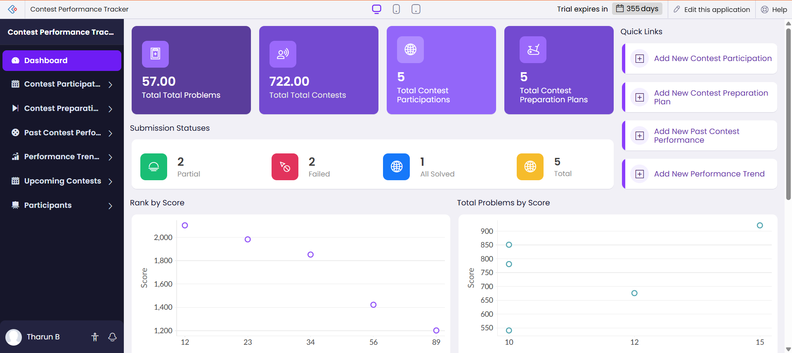
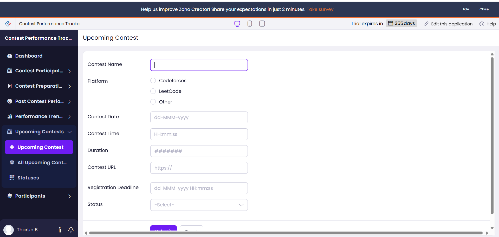
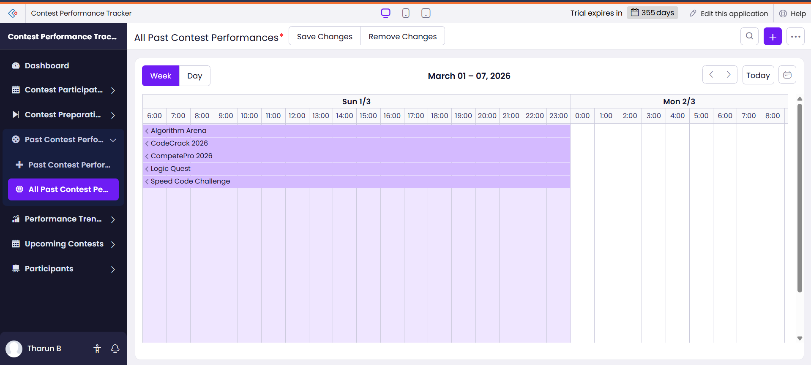
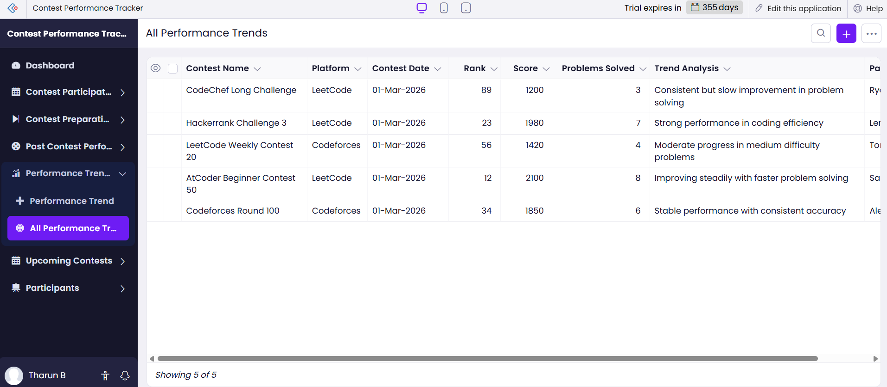

# 📊 Contest Performance Tracker  
### A Zoho Creator Based Low-Code Application

---

## 📌 Project Overview

The **Contest Performance Tracker** is a low-code web application developed using **Zoho Creator** to manage and analyze competitive programming performance.

The system enables users to track contest participation, monitor problem-solving statistics, analyze score trends, and maintain structured preparation plans.

This application demonstrates practical implementation of **Low-Code Application Development** concepts using Zoho Creator's cloud platform.

---

## 🎯 Problem Statement

Competitive programmers often struggle to:

- Track contest performance over time
- Analyze score trends and rankings
- Monitor submission status (Solved / Partial / Failed)
- Plan structured contest preparation
- Maintain centralized performance records

This application provides a unified dashboard-based solution to solve these challenges.

---

## 🛠️ Platform & Technologies Used

- **Zoho Creator (Low-Code Platform)**
- Deluge Scripting
- Built-in Analytics & Reports
- Cloud Deployment (Zoho Hosting)

---

## 🧩 Application Modules

### 1️⃣ Dashboard
- Displays total problems solved
- Total contests participated
- Total preparation plans
- Submission status summary
- Score distribution graphs
- Rank analysis visualization

### 2️⃣ Contest Participation
- Add upcoming contest details
- Store contest name, platform, duration, and score
- Track participation history

### 3️⃣ Contest Preparation Plan
- Create structured preparation schedules
- Track preparation progress
- Maintain improvement roadmap

### 4️⃣ Past Contest Performance
- Record performance statistics
- Store rankings and score
- Identify weak areas

### 5️⃣ Performance Trends
- Visual representation of score growth
- Performance comparison over time
- Trend-based analysis

### 6️⃣ Participants Management
- Maintain participant details
- Store performance records per user

---

## 📊 Key Features

✔ Interactive Dashboard  
✔ Real-time Data Tracking  
✔ Graphical Reports & Analytics  
✔ Role-based Access Control  
✔ Cloud Hosted Application  
✔ Structured Data Management  

---

## 🏗️ Application Architecture
User → Zoho Creator UI → Forms → Reports → Dashboard Analytics

- Data entered via Forms  
- Stored in Zoho Creator database  
- Processed using Deluge logic  
- Visualized through reports and dashboard widgets  

---

## 🌐 Live Application

🔗 **Zoho Live Application:**  
https://creatorapp.zoho.in/tharun2410649_ssn/contest-performance-tracker/

> Note: The live application requires Zoho login access.  
> Screenshots below demonstrate full functionality.

---

## 💻 GitHub Repository

🔗 https://github.com/Tharun-765/zoho-contest-performance-tracker

---

## 📷 Application Screenshots

### 📌 Dashboard

### 📌 Contest Participation Form

### 📌 Reports & Analytics

### 📌 Performance Trend Visualization

---

## 🔐 Deployment Details

- Hosted on Zoho Creator Cloud Platform
- Trial Edition Deployment
- Secure Authentication via Zoho Login
- Accessible via Live Application URL

---

## 📚 Learning Outcomes

Through this project, the following concepts were applied:

- Low-Code Development Principles
- Cloud-Based Application Deployment
- Role & Permission Management
- Dashboard Design & Data Visualization
- Structured Data Modeling
- SaaS Platform Utilization

---

## 👨‍💻 Author

**Tharun B**  
B.E Computer Science Engineering  
UCSV305 – SDL II  
No Code / Low Code App Development  

---

## 🏁 Conclusion

The Contest Performance Tracker successfully demonstrates the design and deployment of a fully functional cloud-hosted low-code application using Zoho Creator.  

It provides a scalable and structured solution for tracking competitive programming performance and showcases practical implementation of modern SaaS-based development platforms.
